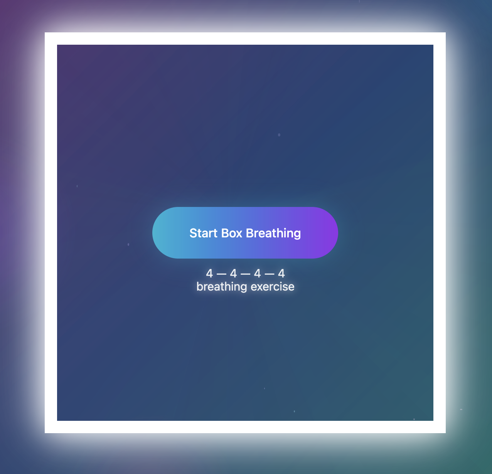

# Box Breathing App

A simple, zero-dependency breathing exercise app. Follow the animated dot around the square border while breathing in sync.

## Features

- 3 rounds of box breathing (Inhale → Hold → Exhale → Hold)
- 4 seconds per side
- Animated background effects and particles
- No build step required

## Running the app

Simply open `index.html` in any browser. No installation needed.

## Live demo

Try the app online: https://gkesaev.github.io/BoxBreathing/

Preview (screenshot):

The screenshot above shows the app's colorful, animated UI — open the live demo link to try the interactive version.
